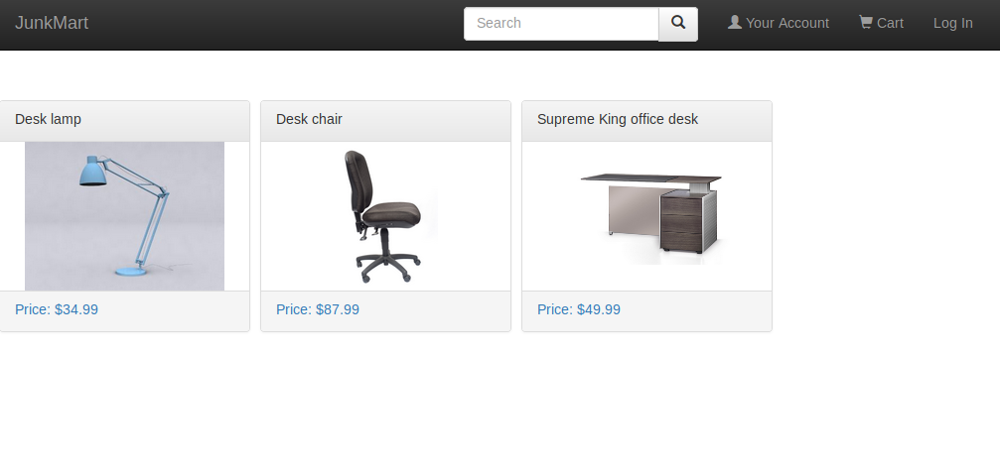
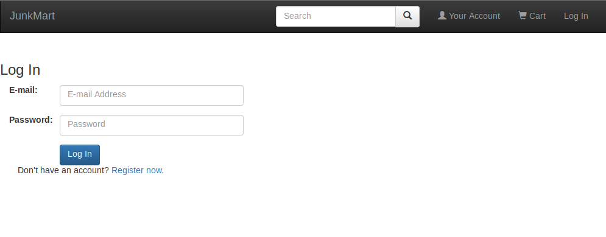
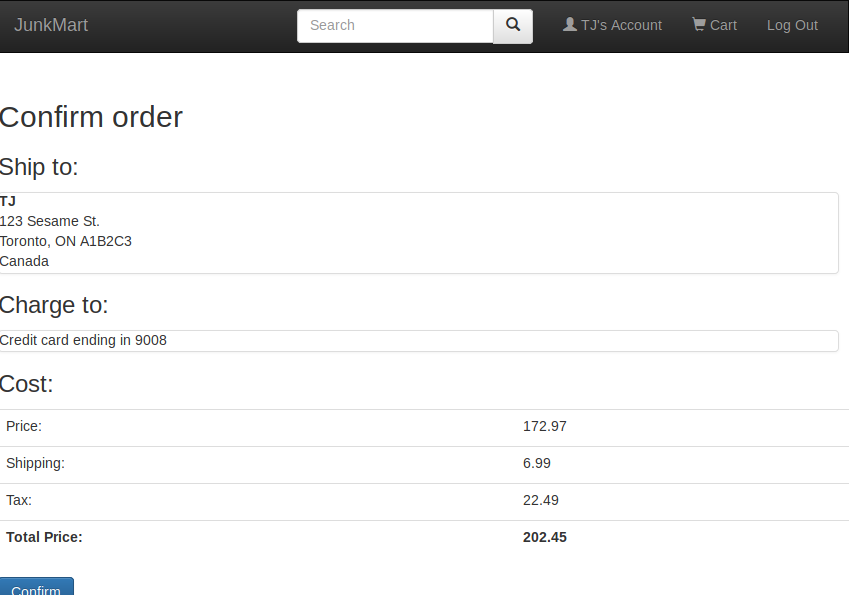
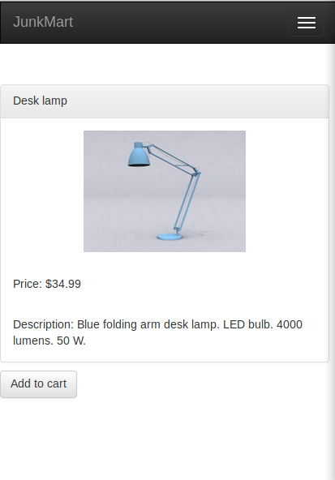

# JunkMart Store

An online shopping application for a fictional company. (This is a rewrite of https://github.com/tjmacd/online-store for php, which originally used node.js.)

## Technologies
- **php**
- Session tracking
- **MySQL** databases
- **Bootstrap**

## Screenshots

